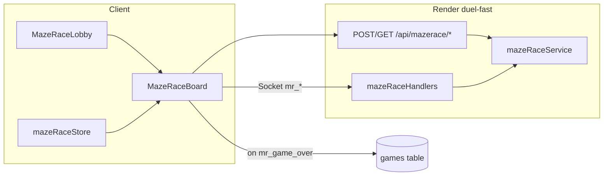

# Maze Race Design

Date: 2026-03-28  
Project: Duel app  
Status: Design spec (post–Dot Dash audit); ready for implementation planning

## Scope

Add **Maze Race**: synchronous real-time multiplayer race through a shared maze on the **same Render Socket.IO server** as Dot Dash (`duel-fast.onrender.com`). Duration target **60–120 seconds**. No Supabase Realtime for gameplay state; no polling.

**In scope**

- Server: new in-memory game module, HTTP routes, Socket.IO handlers, 50 ms authoritative tick.
- Client: lobby + play + result flows, canvas + direction controls (buttons only on mobile path), Zustand store, routes, GamePicker + challenge integration.
- Database: `games.game_type` value `maze_race`; finalize `winner` / `status` on game end like Dot Dash.

**Explicitly out of scope for this spec**

- Changing Dot Dash, Connect Four, Battleship, Draughts, Guess Who, or Word Blitz behavior.
- New Supabase RPCs unless live DB audit proves `initialise_game` must branch on `maze_race` (see Risks).

## Audit baseline (confirmed)

Reference: Dot Dash patterns in:

- [`server/services/dotDashService.js`](../../../server/services/dotDashService.js), [`server/socket/dotDashHandlers.js`](../../../server/socket/dotDashHandlers.js), [`server/routes/dotDash.js`](../../../server/routes/dotDash.js), [`server/server.js`](../../../server/server.js)
- [`src/pages/game/DotDashBoard.tsx`](../../../src/pages/game/DotDashBoard.tsx) (finalize Supabase `games` row on `dd_game_over`)
- [`src/App.tsx`](../../../src/App.tsx) `GlobalChallengeListener` — `dot_dash` special-case: POST create then `navigate`
- [`src/pages/MatchScreen.tsx`](../../../src/pages/MatchScreen.tsx) — same create-before-navigate for accepted challenge
- [`src/pages/game/GamePicker.tsx`](../../../src/pages/game/GamePicker.tsx)
- [`supabase/schema.sql`](../../../supabase/schema.sql) — `games` table (`game_type` is `text`, no enum)

## Goals

1. Two players race **simultaneously** on the **same** randomly chosen preset maze.
2. Player 1 starts **top-left** open cell, goal **bottom-right** exit; Player 2 starts **bottom-right**, goal **top-left** (symmetrical difficulty).
3. **First to reach their own exit** wins; tie-breaking: first tick resolution order (documented in implementation).
4. **Grid:** 19 wide × 21 tall (same footprint as Dot Dash maze).
5. **Mazes:** 8–10 presets as `number[][]` with `0 = open`, `1 = wall`, each **symmetric** under 180° rotation (or stricter symmetry if implementation chooses; minimum: fair path length / structure for both exits).
6. **Hard requirement:** at server startup, run **BFS** from P1 start to P1 goal and from P2 start to P2 goal for **every** preset; **throw** if any maze fails (process must not serve games with invalid mazes).
7. **Controls:** mobile-first **direction buttons only** under the canvas (no swipe on the play surface — unlike current Dot Dash).
8. **Movement:** **one accepted move per tap** — one cell in the tapped direction if the target cell is in bounds and open; invalid moves are ignored (optional client feedback).
9. **Networking:** mirror Dot Dash **architecture** (same `io` server, room per game, `setInterval` 50 ms tick, client `requestAnimationFrame` ~60 fps). **Event names and payloads** follow the product contract below (not `dd_*`).

## Non-goals (YAGNI)

- Spectators, replays, power-ups, procedural maze generation at runtime.
- Persisting maze or positions in Supabase during the match.

## Architecture



- **Authority:** server holds canonical positions, phase, winner; clients may **predict** one cell on local tap and reconcile on each `mr_tick` / `mr_game_started`.
- **Tick:** every 50 ms emit `mr_tick` with positions (and optionally phase guard). Moves can be applied **on `mr_move`** immediately with tick used for sync, **or** queued and applied once per tick — implementation plan picks one; both stay server-authoritative.

## Server-side game state

Aligned with the product interface (extend only if needed for lobby timers):

```typescript
interface MazeRaceGame {
  gameId: string;       // Duel match UUID (same as Dot Dash keyed lobby)
  matchId: string;      // same as gameId for routing consistency
  phase: 'lobby' | 'countdown' | 'playing' | 'finished';
  maze: number[][];       // 21 x 19 rows x cols
  mazeIndex: number;

  player1: { userId: string; x: number; y: number; ready: boolean };
  player2: { userId: string; x: number; y: number; ready: boolean };

  startedAt: number | null;
  winner: string | null;   // userId
  finishedAt: number | null;
}
```

**Starts/goals (fixed):**

- P1 start: `(1, 1)` or first open cell from top-left scan; P1 goal: bottom-right open cell (e.g. `(17, 19)` — exact coordinates derived from maze layout).
- P2 start/goal: opposite corners (180° symmetric to P1).

Preset authoring must place walls so corner cells are open and goals match spec.

## Socket.IO contract

**Room:** `mr:${gameId}` (parallel to `dd:${gameId}`).

### Client → server

| Event     | Payload |
|-----------|---------|
| `mr_join` | `{ gameId, userId }` |
| `mr_ready`| `{ gameId, userId }` |
| `mr_move` | `{ gameId, userId, direction: 'up' \| 'down' \| 'left' \| 'right' }` |

Optional parity with Dot Dash: `mr_forfeit` `{ gameId, userId }` (recommended for UX consistency).

### Server → client

| Event                      | Payload |
|----------------------------|---------|
| `mr_lobby_update`          | `{ player1Ready, player2Ready }` (may add names/avatars later for parity) |
| `mr_countdown`             | `{ count: 3 \| 2 \| 1 }` — emit once per second |
| `mr_game_started`          | `{ gameState }` — full serializable state |
| `mr_tick`                  | `{ player1: { x, y }, player2: { x, y } }` every 50 ms while `playing` |
| `mr_game_over`             | `{ winner: userId, finalState }` |
| `mr_opponent_disconnected` | `{}` (optional message later) |
| `mr_error`                 | `{ message }` — mirror `dd_error` pattern |

**Disconnect:** mirror Dot Dash: notify opponent, 30 s grace, then forfeit win for remaining player (same semantics as `dotDashHandlers.js`).

## HTTP routes (Express)

Mounted at `/api/mazerace` in [`server/server.js`](../../../server/server.js):

| Method | Path                         | Behavior |
|--------|------------------------------|----------|
| `POST` | `/api/mazerace/create`       | Body: same shape as Dot Dash create (`gameId?`, `player1Id`, `player1Name`, `player1Avatar?`, `player2Id`, `player2Name`, `player2Avatar?`). Create in-memory game; return `{ gameId }`. Idempotent while active lobby/play; if `finished`, allow recreate like Dot Dash. |
| `GET`  | `/api/mazerace/:gameId`      | Return minimal state, e.g. `{ gameId, phase }`, or small JSON for debugging — match Dot Dash `GET` depth unless product needs more. |

Optional: `POST /api/mazerace/:gameId/join` if P2 placeholder pattern matches Dot Dash (`player2` sentinel).

## Client routes and navigation

- `GlobalChallengeListener` and `MatchScreen`: **`maze_race` isolated branch** — POST `${SERVER_URL}/api/mazerace/create` with `gameId: matchId`, sorted players, then `navigate('/mazerace/${matchId}/lobby')` (lobby first per product flow).
- Routes in [`src/App.tsx`](../../../src/App.tsx):
  - `/mazerace/:matchId/lobby` — `MazeRaceLobby`
  - `/mazerace/:matchId/play` — `MazeRaceBoard` (ErrorBoundary optional, match Dot Dash)
  - `/mazerace/:matchId/result` — `MazeRaceResult`
- [`src/lib/challengeGameFlow.ts`](../../../src/lib/challengeGameFlow.ts): add `maze_race` to `CanonicalGameType`, `normalizeGameType`, `resolveGameRoute` → lobby path.

## Supabase `games` table

- On `mr_game_over`, update active row: `match_id`, `game_type === 'maze_race'`, `winner IS NULL` — set `winner` to `'player1' | 'player2'` (or user id fallback only if required — follow Dot Dash pattern in `DotDashBoard.tsx`).
- `status`: `'finished'` or `'abandoned'` on forfeit/disconnect.
- **Before merge:** confirm partial unique index on `(match_id, game_type) WHERE winner IS NULL` exists on **live** DB (see [`supabase/review_only/20260321_rls_indexes_cascade.sql`](../../../supabase/review_only/20260321_rls_indexes_cascade.sql)).
- **`initialise_game`:** run `SELECT` / RPC check on live DB; if `maze_race` is unsupported, add migration + deploy before relying on `prepareAcceptedChallenge` for this type.

## Visual design

Match Duel / Dot Dash patterns:

- Background **#12122A**; walls **Electric Mint** outline **#4EFFC4**; paths slightly lighter than background.
- P1 **Hot Bubblegum #FF6BA8**; P2 **Pixel Cyan #00D9FF**; black outlines; pixel-style sprites (canvas draw or small assets).
- Exit markers **Lemon Pop #FFE66D** with subtle pulse.
- Typography: `font-display` (Return of the Boss), `font-body` (Balsamiq Sans), timer **JetBrains Mono**.

## Game flow (UX)

1. Challenger picks Maze Race in GamePicker → mutual challenge → both use create + lobby.
2. Lobby: both tap Ready → server enters `countdown`, emits `mr_countdown` 3,2,1 → `mr_game_started`.
3. Play: simultaneous racing until `mr_game_over`.
4. Result screen → post-game chat via existing hooks (`usePostGameRedirect`, same pattern as [`DotDashResult.tsx`](../../../src/pages/game/DotDashResult.tsx)).

## Testing and verification

- Local: run Node server + Vite; two browser profiles; full lobby → race → result.
- `npm run build` before merge.
- Manual: challenge from GamePicker, accept from MatchScreen, toast path in App for inviter.

## Risks and open decisions

1. **`initialise_game`:** Must verify live RPC accepts new `game_type` rows; add SQL if it validates an allowlist.
2. **Symmetry:** Define precise rule (180° rotation of grid + swap starts) so validators and artists agree.
3. **Tick vs move:** Choose immediate `mr_move` apply vs tick-queued; document for client prediction.
4. **Lobby expiry:** Dot Dash uses 10 min lobby expiry — mirror for Maze Race for consistency.

## References

- Original product brief: Maze Race requirements (Socket `mr_*` contract, BFS validation, integration with GamePicker / challenges / `games` table).
- Dot Dash audit baseline: pre-implementation review of server, `DotDashBoard`, `GlobalChallengeListener`, `GamePicker`, and `games` schema (2026-03-28).
